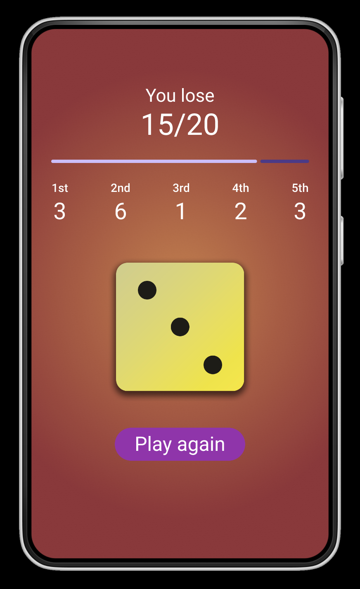

# Lab 01 - Dice Rolling App

In this lab, you will use Flutter and Dart to fulfill the following functional requirements.

The files for the dice function and background setting function have been completed. Only three functional parts need to be implemented (there are no restrictions on layout design, except for the **background color of requirement 2**, as long as the function is implemented).

## Grading

(50%)  

(1) (20%) Display the **score of each dice** roll in this round (display **"--"** if not completed),

   

(10%) and show how many dice have been rolled in the current five opportunities (for example, **Chance left: 4**),  

(20%) along with the **current total score**(for example, **Your score: 3/20**).

  

(50%)  

(2) (15%) A **progress bar** is displayed to track the distance to the **20-points** goal. 

  

(20%) Upon completion (**score >= 20**), the background will change to a **green gradient**, and a **congratulations message** will be displayed (e.g., 'You win'). Conversely, if not completed(**score < 20**), the background will change to a **red gradient**, and a **failure message** will be displayed (e.g., 'You lose').

  
  

(15%) Modify the dice roll button to display **"Play again"** at the end of each round to start the next round.

 

  

## Deadline
Submit your work before 2024/02/29 (Thur.) 17:20:00.

The score you have done will be 100%.

Submit your work before 2024/02/29 (Thur.) 23:59:59.

The score of other part you have done after 17:20:00 will be 60%.

# Resources

A few introductory tutorials designed to help you learn layout.
- [Table class](https://api.flutter.dev/flutter/widgets/Table-class.html)
- [LinearProgressIndicator class](https://api.flutter.dev/flutter/material/LinearProgressIndicator-class.html)